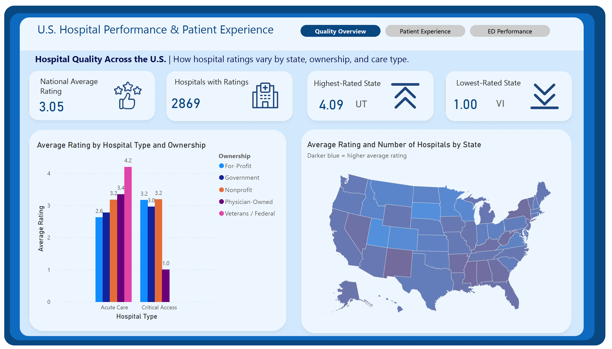
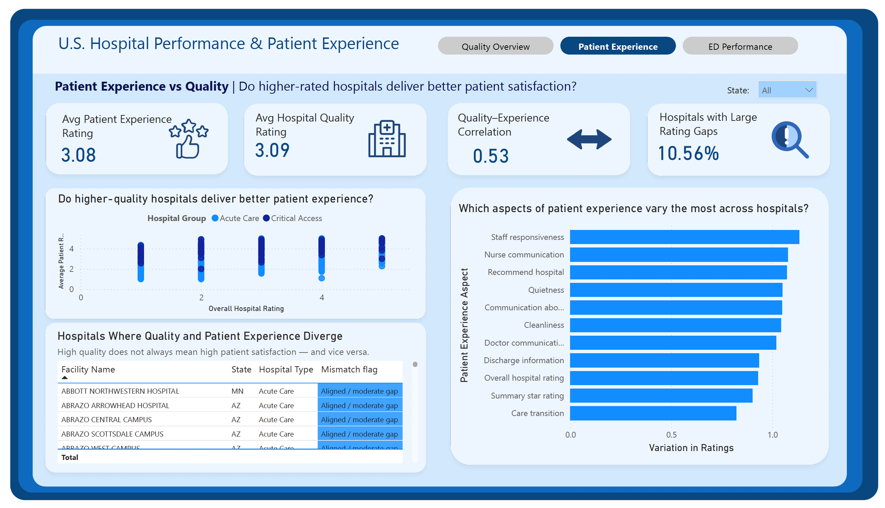
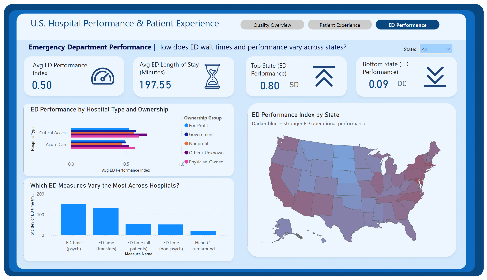

# U.S. Hospital Performance & Patient Experience Analytics

An end-to-end analytics project analyzing hospital quality, patient experience, and Emergency Department (ED) operational performance across the United States using CMS public data, SQL-based data modeling, and Power BI dashboards.

This project answers key healthcare performance questions by building a small analytical warehouse and delivering interactive visual insights.

---

## Project Overview

This project explores how hospital quality ratings, patient experience, and ED operational performance vary across:
- States  
- Hospital types  
- Ownership categories  

The analysis is structured around three analytical themes:

1. **Overall Hospital Quality (Star Ratings)**
2. **Patient Experience (HCAHPS)**
3. **Timely & Effective Care (Emergency Department Operations)**

The final output is an interactive Power BI report with three dashboard pages corresponding to these themes.

---

## Data Sources

All datasets come from the Centers for Medicare & Medicaid Services (CMS) Provider Data portal:

- **Hospital General Information**  
  https://data.cms.gov/provider-data/dataset/84jm-wiui

- **HCAHPS (Patient Experience Survey Results)**  
  https://data.cms.gov/provider-data/dataset/xubh-q36u

- **Timely & Effective Care (ED Performance Metrics)**  
  https://data.cms.gov/provider-data/dataset/yv7e-xc69

📘 Data Dictionary:  
https://data.cms.gov/provider-data/sites/default/files/data_dictionaries/hospital/HOSPITAL_Data_Dictionary.pdf

Raw CSV files are stored in the `/Data` folder.

---

## Data Modeling (SQL Warehouse)

The project uses a simple star-schema style warehouse:

**Dimension**
- `dim_hospital` – hospital profile & attributes (state, ownership, type, ED availability)

**Fact Tables**
- `fact_overall_rating` – CMS overall star ratings  
- `fact_patients_rating` – HCAHPS patient experience ratings  

**Analytical Views**
- `vw_avg_rating_by_state`
- `vw_avg_rating_by_type_ownership`
- `vw_patient_vs_overall_rating`
- `vw_hcahps_aspect_variation`
- `vw_patient_rating_mismatch`
- `vw_ed_performance_unified`

SQL scripts used to build and analyze the warehouse are available in the `/SQL` folder:
- `create_tables.sql`
- `views.sql`
- `analytics.sql`

---
## Analysis Area 1 — Overall Hospital Quality (Star Ratings)

### Research Questions

**RQ1. How are hospital star ratings distributed across the U.S.?**  
- How do average hospital ratings vary by state?  
- Which states have the highest and lowest average ratings?  
- What does the national distribution of ratings look like?

**RQ2. Does hospital type or ownership matter for star ratings?**  
- Do Acute Care and Critical Access hospitals differ in average ratings?  
- Are there systematic differences by ownership type (Government, Nonprofit, For-Profit, Veterans/Federal)?  
- Does the presence of emergency services relate to higher or lower ratings?

---

### Dashboard — Hospital Quality Overview

---

**Geographic variation in hospital quality (RQ1)**  
The state-level map shows clear geographic differences in average hospital ratings across the U.S. Darker blue states indicate higher average quality, making it easy to spot regional patterns. This directly answers whether hospital quality is evenly distributed or varies by location. The KPI cards highlight the **highest-rated state (Utah)** and **lowest-rated state (Virgin Islands)**, making cross-state disparities immediately visible.

**National context for hospital quality (RQ1)**  
The national average rating KPI provides an anchor point for interpreting state performance. This helps distinguish whether high-performing states are truly exceptional or just marginally above the national baseline.

**Hospital type and ownership effects (RQ2)**  
The grouped bar chart comparing **Acute Care vs Critical Access hospitals across ownership types** reveals meaningful structural differences. Ownership appears to matter: Veterans/Federal hospitals show notably higher ratings among Acute Care facilities, while Physician-Owned Critical Access hospitals appear to underperform. This visualization makes it easy to compare quality outcomes across organizational models, directly addressing whether hospital structure influences ratings.

**Structural inequalities in quality (RQ2)**  
By combining hospital type and ownership in a single view, the dashboard highlights that quality differences are not driven by one factor alone. Some ownership types perform well in Acute Care settings but not in Critical Access hospitals, suggesting that organizational resources and hospital scale may interact in shaping quality outcomes.

**Summary Insight**  
Hospital quality is not uniform across the U.S. or across hospital structures. Both **geography** and **institutional characteristics (type and ownership)** play a meaningful role in explaining variation in star ratings. This suggests that patients’ access to high-quality care depends not just on the hospital they choose, but also on **where they live and what type of hospital serves their community**.

## Analysis Area — Patient Experience vs Hospital Quality

### Key Questions

**RQ3. How strongly does overall hospital quality align with patient satisfaction?**  
This question examines whether CMS overall hospital star ratings are reflected in patient-reported experience (HCAHPS).

**RQ4. Which aspects of patient experience show the greatest variation across hospitals?**  
This focuses on identifying which dimensions of patient experience (e.g., staff responsiveness, communication, cleanliness) differ the most from hospital to hospital.

---

### Dashboard: Patient Experience vs Quality

---

**Alignment between hospital quality and patient experience (RQ3)**  
The scatter plot comparing **overall hospital star ratings vs average patient experience ratings** shows a **moderate positive relationship** (correlation ≈ 0.53).

- On average, higher-rated hospitals tend to receive better patient satisfaction scores.  
- However, the wide spread within each star-rating category indicates that **overall quality ratings do not fully explain patient experience**.  
- This suggests that clinical quality metrics and patient-perceived experience capture **related but distinct dimensions** of hospital performance.

---

**Hospitals where quality and experience diverge**  
The table of hospitals with **large rating gaps** highlights meaningful outliers:

- Some hospitals with **high overall quality ratings receive relatively low patient experience scores**.  
- Conversely, some **lower-rated hospitals perform well on patient satisfaction**, indicating strong patient-facing care despite weaker performance on overall quality measures.

This reinforces that **high clinical quality does not automatically translate into high patient satisfaction**, and vice versa.

---

**Which patient experience dimensions vary the most? (RQ4)**  
The variation chart shows that:

- **Staff responsiveness, nurse communication, and likelihood to recommend the hospital** exhibit the greatest variation across hospitals.  
- More standardized dimensions (e.g., cleanliness, discharge information) show comparatively lower variation.

This suggests that **interpersonal and service-oriented aspects of care are less consistent nationwide** and may represent the biggest opportunities for improvement.

---

**Practical takeaway**  
From a quality improvement and policy perspective:

- Improving patient experience likely requires **targeted, operational changes** in communication, responsiveness, and care coordination rather than broad, hospital-wide quality initiatives alone.  
- Patient experience metrics provide **complementary insight** to hospital star ratings and help surface performance gaps that overall quality scores may not reveal.

## Analysis Area 3 — ED Operations & Timely Care

### Research Questions

**RQ5. How does Emergency Department performance vary across hospitals and states?**  
- How do ED wait times and performance differ by state?  
- Which states consistently perform better or worse on ED operational metrics?  
- How much variation exists across hospitals within the same state?

**RQ6. Do hospital characteristics influence ED delays and performance?**  
- Are ED outcomes different by hospital type (Acute Care vs Critical Access)?  
- Do ownership models (Government, Nonprofit, For-Profit, Physician-Owned) show systematic differences in ED performance?  
- Are certain ED measures (e.g., psych ED time, transfers) more variable than others?

---

### Dashboard: Emergency Department Performance

---

**ED Performance by State (Map)**  
- The choropleth map shows the **ED Performance Index by state**, with darker blue indicating stronger operational performance.  
- This directly addresses **RQ5** by revealing clear geographic patterns in ED performance, highlighting clusters of higher- and lower-performing states.  
- The “Top State” and “Bottom State” KPI cards summarize extremes, making state-level disparities immediately visible.

**ED Performance Index by Hospital Type & Ownership (Bar Chart)**  
- This chart compares average ED performance across **Acute Care vs Critical Access hospitals** and ownership groups.  
- It answers **RQ6** by showing whether certain hospital profiles systematically outperform others operationally.  
- Differences between ownership groups suggest that organizational structure may influence ED efficiency and throughput.

**Which ED Measures Vary the Most (Variation Bar Chart)**  
- The variation chart ranks ED measures by their cross-hospital standard deviation (e.g., ED time for psych patients, transfers, non-psych).  
- This supports both **RQ5 and RQ6** by identifying which parts of the ED workflow are most inconsistent across hospitals.  
- High variation in psych ED time and transfers points to operational bottlenecks that may be harder to standardize.

**KPI Cards (ED Performance Index & Avg Length of Stay)**  
- The national average ED performance index and average ED length of stay provide context for overall system performance.  
- These KPIs anchor the analysis by showing whether state- and hospital-level differences occur around a relatively strong or weak national baseline.

---

### Key Insights

- **ED performance varies substantially by state**, suggesting that regional policies, patient mix, and healthcare infrastructure play an important role in operational efficiency.  
- **Hospital type and ownership matter**: Critical Access hospitals and certain ownership groups show systematically different performance profiles, indicating structural constraints or operational advantages.  
- **Not all ED processes are equally stable**: ED time for psychiatric patients and transfers exhibit the greatest variation, pointing to persistent bottlenecks in mental health care pathways and patient handoffs.  
- **Composite performance hides nuance**: While the ED Performance Index summarizes overall operations, the measure-level variation reveals where targeted improvements could yield the biggest gains.

Together, these visuals provide a multi-level view of ED operations—connecting **state-level patterns**, **hospital characteristics**, and **process-level variability** to explain where and why ED performance diverges across the U.S.

---

## Tools & Technologies

- **SQL Server** – data modeling, transformations, and analytics  
- **Power BI** – interactive dashboards & storytelling  
- **CMS Public Healthcare Data** – real-world healthcare performance data  

---

## Key Takeaways

- Hospital quality varies meaningfully by **state, ownership, and care type**  
- High overall quality does **not always** guarantee strong patient experience  
- ED operational performance shows large geographic and institutional variation  
- Certain patient experience aspects (e.g., staff responsiveness) are more inconsistent than others  

--- 